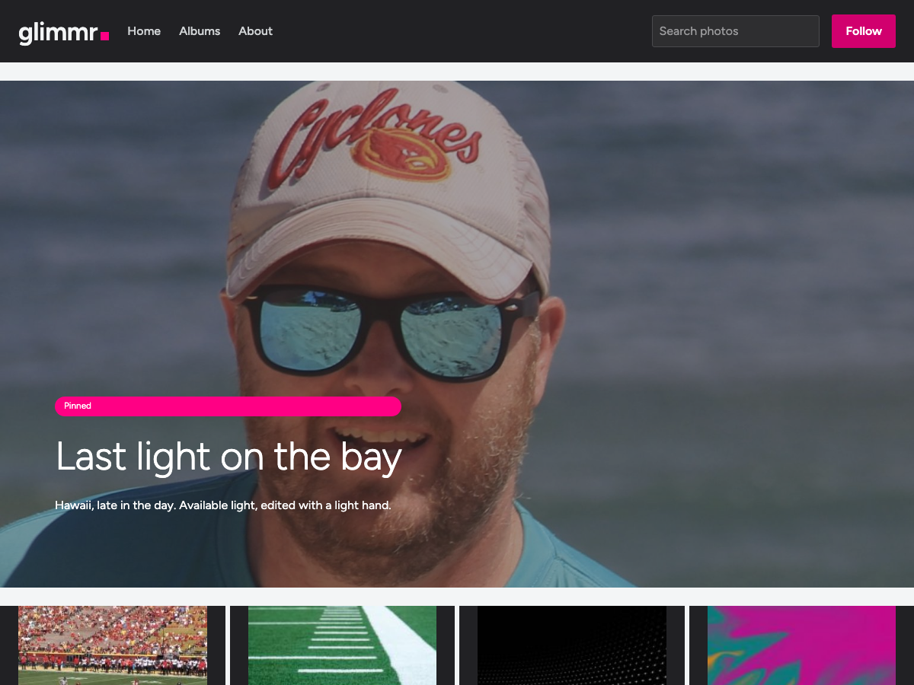

# Glimmr

A fast, image-first WordPress block theme for personal photo galleries. The chrome stays quiet and near-monochrome (Ink, white, and Mist) so the only saturated colour on the page is your photography, with a single hot Glimmr Pink reserved for action and focus.



## Overview

Glimmr is built entirely from core WordPress blocks, configured through `theme.json` and a small amount of theme CSS. It pairs a photo-first front end (a pinned hero, a justified square photostream, a native lightbox on single photos) with a calmer, text-forward Journal track for writing. Six switchable style variations re-skin the whole site, and three of them apply a global duotone to every photo.

The theme is content-agnostic: it ships templates, parts, patterns, and styles, never content. No category or tag slugs are hardcoded anywhere; archive heroes read the queried term, and the front-page pin is simply a sticky post.

## Features

- Pinned front-page hero driven by a sticky post's featured image.
- Justified, square-cornered photostream with a hover scrim and title fade.
- Single-photo screen with a native core lightbox and a camera-style EXIF readout.
- A writing-forward Journal track with a looser reading measure.
- Custom taxonomy featured-image control that drives each category or tag's cover hero.
- Twelve block patterns across two categories (photo and journal).
- Six style variations: Daylight, Midnight, Silver, Sepia, Cyanotype, and Gallery.
- Self-hosted Figtree (variable woff2), so no third-party font requests.
- Built for accessibility: visible focus rings, reduced-motion support, and AA-corrected action colours.

## Requirements

- WordPress 6.9 or newer (tested up to 7.0).
- PHP 8.0 or newer.

## Installation

1. Download or clone this repository into `wp-content/themes/glimmr`.
2. In the admin, go to Appearance, Themes, and activate Glimmr.
3. For the best front page, set Settings, Reading to show your latest posts, and mark one post as sticky to feature it in the hero.

## Recommended plugin (optional)

Single-photo EXIF uses [X3P0: Media Data](https://wordpress.org/plugins/x3p0-media-data/) by Justin Tadlock, which provides the EXIF and ID3 metadata blocks. The gallery, archives, and every other screen work without it; only the single-photo camera readout (camera, aperture, shutter, ISO, focal length, and date) needs it. Install it from Plugins, Add New, and search for "X3P0 Media Data".

## Style variations

Switch in Appearance, Editor, Styles:

| Variation | Treatment |
| --- | --- |
| Daylight | The default light theme. |
| Midnight | A dark room: near-black chrome and surfaces, a brighter pink. |
| Silver | Black and white; a grayscale duotone over every photo. |
| Sepia | Warm and analogue; a sepia duotone and a toasted paper page. |
| Cyanotype | Blueprint blue; a cyanotype duotone and a cool paper page. |
| Gallery | Museum white; generous air, no duotone. |

Each variation changes only the tokens, so the same templates and blocks re-skin with no markup change.

## Taxonomy featured image

Editing a category or tag adds a Featured image control (a media picker that stores an attachment id as term meta). That image becomes the term archive's cover hero. It is surfaced through a `glimmr/term-image` binding source and a scoped cover render filter, so the archive template stays pure block markup.

## Templates and patterns

Templates: `front-page`, `index`, `archive`, `single`, `page`, `search`, `404`, and a `Link in bio` page template. Parts: `header` and `footer`.

Patterns are grouped under two categories, "Glimmr: Photo" (heroes, album showcase, link in bio, about, colophon, subscribe, closing CTA) and "Glimmr: Journal" (query loop, single, notes). Insert them from the block inserter.

## Development

Everything is plain files; there is no build step. Design configuration lives in `theme.json`, with a single stylesheet at `assets/css/glimmr.css` for what `theme.json` cannot express (the photostream grid, hover scrim, nav submenu, chip bar, and EXIF readout). PHP is kept minimal: asset loading and pattern categories in `functions.php`, the taxonomy featured-image feature in `inc/featured-term-image.php`, and the block-binding sources in `inc/block-bindings.php`.

```
glimmr/
├── theme.json            Design tokens, presets, and base styles
├── style.css             Theme header
├── functions.php         Asset loading, pattern categories, feature includes
├── inc/                  Taxonomy featured image + block-binding sources
├── templates/            Block templates
├── parts/                Header and footer
├── patterns/             Twelve block patterns
├── styles/               Six style variations
└── assets/               Fonts, CSS, JS, and pattern placeholder images
```

## Credits and licence

- Typeface: [Figtree](https://github.com/erikdkennedy/figtree) by Erik Kennedy (SIL Open Font License 1.1).
- EXIF blocks (optional): [X3P0: Media Data](https://github.com/x3p0-dev/x3p0-media-data) by Justin Tadlock.

Glimmr is released under the GPL-2.0-or-later licence. See [LICENSE](LICENSE) for details.
